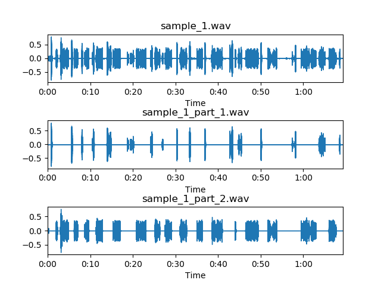

### 1. Overview  
&emsp;This repo was created to separate **two speakers** from **a telephone recording**.  
&emsp;If your telephone recording has more than two speakers, I can't guarantee that my method will work.  
&emsp;In addition to this one, to get good result, please try to make sure that different speakers have the same length of speech.  

---

### 2. Implement   
&emsp;1. Split a wave to audio clips by remove mute   
&emsp;2. Count all clips' id-vector use pre-trained speaker recognition model    
&emsp;3. Use K-means to cluster all clips' id-vector when K=2   

---

### 3. Result  
  

---

### 4. Appendix   
&emsp;1. The pre-trained speaker recognition model from [WeidiXie](https://github.com/WeidiXie)'s repo [VGG-Speaker-Recognition](https://github.com/WeidiXie/VGG-Speaker-Recognition). Thanks for the open source!   
&emsp;2. Because my method looks like a non-supervised method, so you can try supervised method even end2end. You can get more information about speaker diarization from [Here](https://github.com/wq2012/awesome-diarization)    
